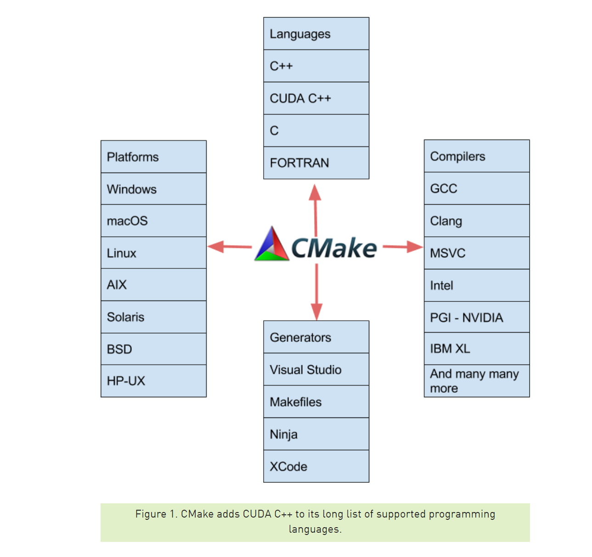

# CMake 编写 CUDA 应用程序
从cmake 3.9版本开始，cmake就原生支持了cuda c/c++。再这之前，是通过find_package(CUDA REQUIRED)来间接支持cuda c/c++的。这种写法不仅繁琐而且丑陋。所以这里主要介绍3.9版本之后引入的方法，cuda c/c++程序可以使用和普通的c/c++程序完全一样的操作，甚至两者可以混合使用，非常的方便，清晰明了。

本文便通过一个例子（对比矩阵运算在GPU与CPU计算速度）来具体讲解。

## 准备工作
#### 安装cuda driver
具体参考nvidia官方文档，这里不再赘述。 
#### 安装cuda toolkit
这里推荐使用conda环境，具体配置过程参考我的[PackageManage](../PackageaManage/README.md)一节。配置完成后，使用conda安装cudatoolkit。
```bash
conda install cudatoolkit=10.1  # 也可以选择你需要的版本 
```
本文的代码示例使用到了cudatookit 中的cublas库进行矩阵运算。
#### 安装openblas
本文的代码示例将对比cublas与openblas计算矩阵的速度
```bash
conda install -c anaconda openblas
```

## 定义`FindcBlas`,`FindcuBlas`模块
为了找到cuBlas，openBlas的相关库文件和头文件位置，我们需要为`find_package`方法编写相应的模块（具体参见[FindPackage](../FindPackage/README.md)章节）。
这里我们直接参考Github上的实现[https://github.com/CNugteren/CLBlast/tree/master/cmake/Modules](https://github.com/CNugteren/CLBlast/tree/master/cmake/Modules)。将`FindcBLAS.cmake`与`FindcuBlas.cmake`存放在cmake目录下。